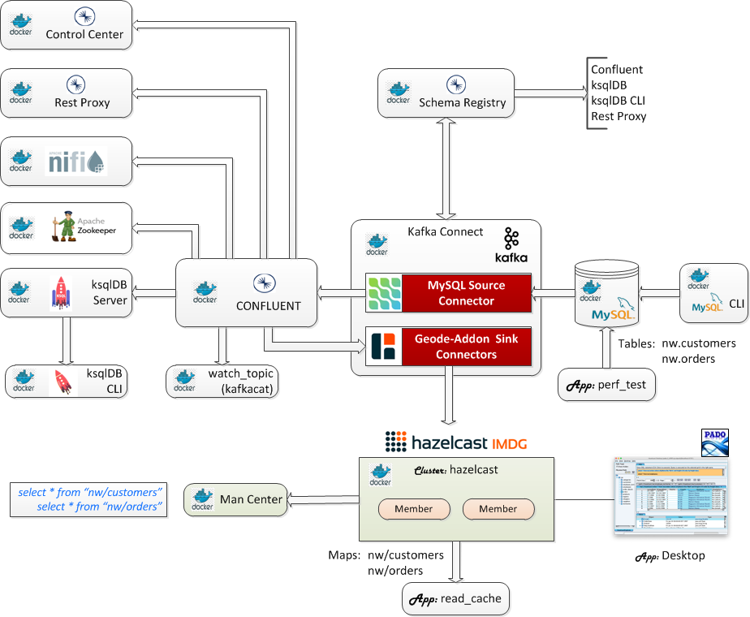
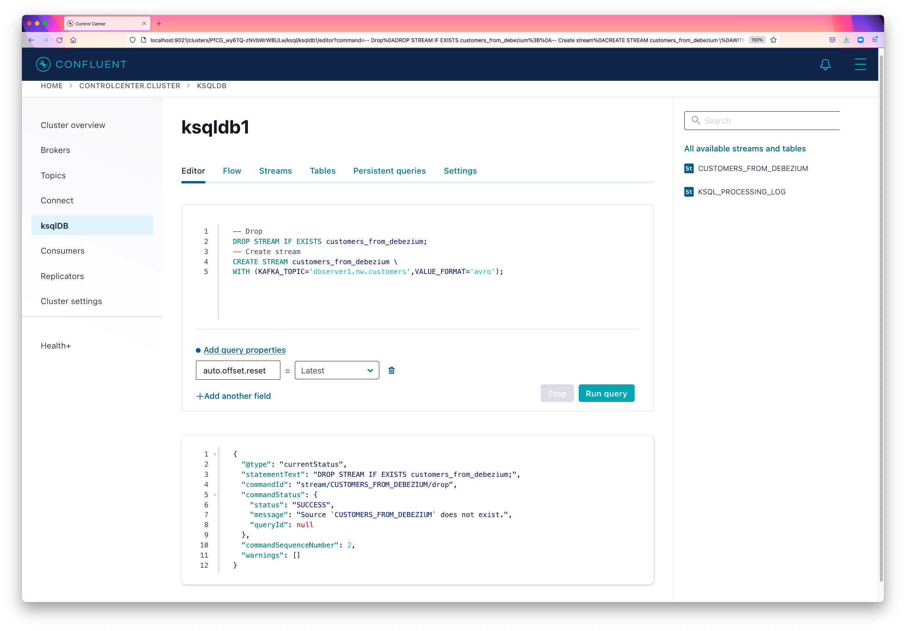
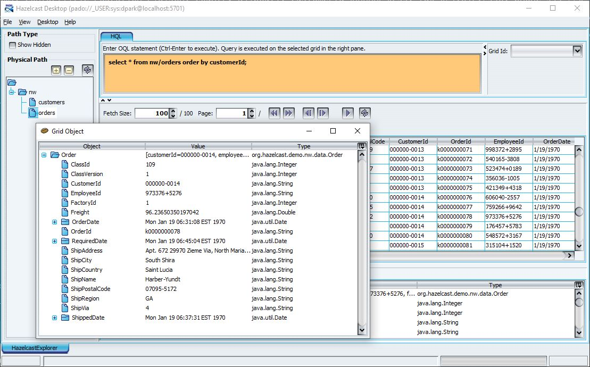
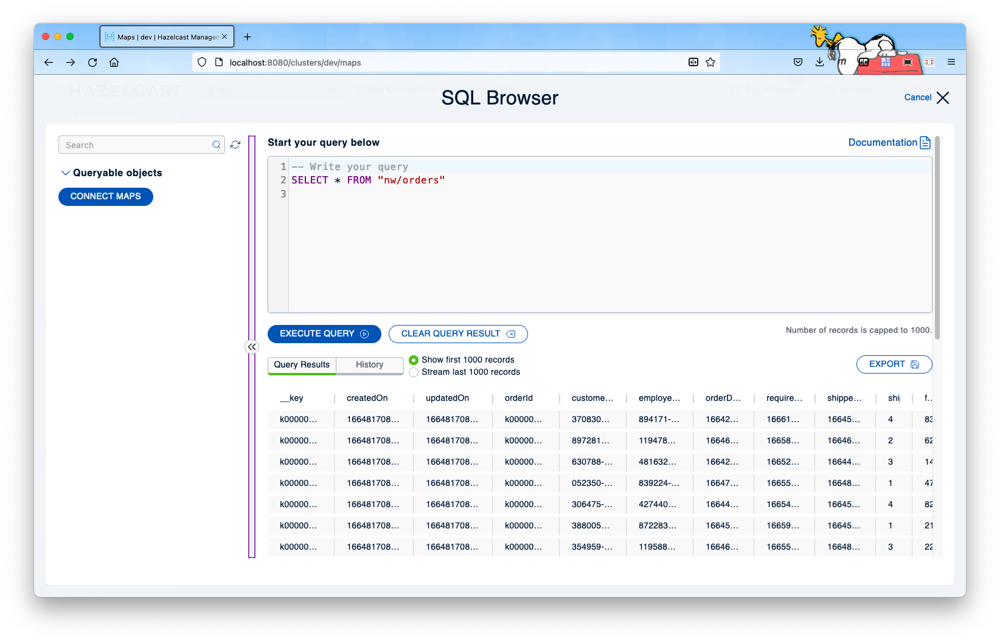

 [*PadoGrid*](https://github.com/padogrid) | [*Catalogs*](https://github.com/padogrid/catalog-bundles/blob/master/all-catalog.md) | [*Manual*](https://github.com/padogrid/padogrid/wiki) | [*FAQ*](https://github.com/padogrid/padogrid/wiki/faq) | [*Releases*](https://github.com/padogrid/padogrid/releases) | [*Templates*](https://github.com/padogrid/padogrid/wiki/Using-Bundle-Templates) | [*Pods*](https://github.com/padogrid/padogrid/wiki/Understanding-Padogrid-Pods) | [*Kubernetes*](https://github.com/padogrid/padogrid/wiki/Kubernetes) | [*Docker*](https://github.com/padogrid/padogrid/wiki/Docker) | [*Apps*](https://github.com/padogrid/padogrid/wiki/Apps) | [*Quick Start*](https://github.com/padogrid/padogrid/wiki/Quick-Start)

---

<!-- Platforms -->
[](https://github.com/padogrid/padogrid/wiki/Platform-Host-OS)

# Debezium-ksqlDB-Confluent Hazelcast Connector

This bundle integrates Hazelcast with Debezium and Confluent ksqlDB for ingesting initial data and CDC records from MySQL into Kafka and Hazelcast via a Kafka sink connector included in the `padogrid` distribution.

## Installing Bundle

```bash
install_bundle -download -workspace bundle-hazelcast-5-docker-debezium_ksqldb_confluent
```

:exclamation: If you are running this bundle on WSL, make sure your workspace is on a shared folder. The Docker volume it creates will not be visible outside of WSL otherwise.

## Use Case

This use case ingests data changes made in the MySQL database into Kafka and Hazelcast via Kafka connectors and integrates Confluent ksqlDB for querying Kafka topics as external tables and views. It extends [the original Debezium-Kafka bundle](https://github.com/padogrid/bundle-hazelcast-3n4n5-docker-debezium_kafka) with Docker compose, Confluent ksqlDB, and  the Northwind mock data for `customers` and `orders` tables. It includes the MySQL source connector and the `hazelcast-addon` Debezium sink connectors.



## Required Software

- PadoGrid 0.9.13+ (PRODUCT=none)
- Docker Compose
- Maven 3.x

## Optional Software

- jq
- Terraform - In addition to Docker Compose, Terraform artifacts are also provided in case it is preferred.

## Building Demo

### Hazelcast 5.1+

:exclamation: This bundle has been tested with Hazelcast 5.1.3.

```bash
# Check product versions
show_products

# Install 5.1+
install_padogrid -product hazelcast-oss

# Update your workspace with Hazelcast 5.1+
update_padogrid -product hazelcast-oss
```

### Build Bundle

We must first build the bundle by running the `build_app` command as shown below. This command copies the Hazelcast, `padogrid-common`, and `hazelcast-addon-core` jar files to the Docker container mounted volume in the `padogrid` directory so that the Hazelcast Debezium Kafka connector can include them in its class path. It also downloads the ksql JDBC driver jar and its dependencies in the `padogrid/lib/jdbc` directory.

```bash
cd_docker debezium_cp/bin_sh
./build_app
```

Upon successful build, the `padogrid` directory should have jar files similar to the following:

```bash
cd_docker debezium_cp
tree padogrid
```

Output:

```console
padogrid/
├── etc
│   ├── hazelcast-client.xml
│   └── hazelcast.xml
├── lib
│   ├── ...
│   ├── hazelcast-addon-common-5-0.9.21.jar
│   ├── hazelcast-addon-core-5-0.9.21.jar
│   ├── ...
│   ├── hazelcast-5.1.3.jar
│   ├── ...
│   ├── padogrid-common-0.9.21.jar
│   ├── ...
├── log
└── plugins
    └── hazelcast-addon-core-5-0.9.21-tests.jar
```

### Create Hazelcast Docker Containers

Let's create a Hazelcast cluster to run on Docker containers as follows. If you have not installed Hazelcast, then run the `install_padogrid -product hazelcast` command to install the version of your choice and then run the `update_product -product hazelcast` command to set the version. Make sure the Hazelcast version is 5.1+.

```bash
create_docker -product hazelcast -cluster hazelcast -host host.docker.internal
cd_docker hazelcast
```

If you are running Docker Desktop, then the host name, `host.docker.internal`, is accessible from the containers as well as the host machine. You can run the `ping` command to check the host name.

```bash
ping host.docker.internal
```

If `host.docker.internal` is not defined then you will need to use the host IP address that can be accessed from both the Docker containers and the host machine. Run `create_docker -?` or `man create_docker` to see the usage.

```bash
create_docker -?
```

If you are using a host IP other than `host.docker.internal` then you must also make the change in the Debezium Hazelcast connector configuration file as follows.

```bash
cd_docker debezium_cp
vi padogrid/etc/hazelcast-client.xml
```

Replace `host.docker.internal` in `hazelcast-client.xml` with your host IP address.

```xml
<hazelcast-client ...>
   ...
   <network>
      <cluster-members>
         <address>host.docker.internal:5701</address>
         <address>host.docker.internal:5702</address>
      </cluster-members>
   </network>
   ...
</hazelcast-client>
```

If you will be running the Desktop app then you also need to register the `org.hazelcast.demo.nw.data.PortableFactoryImpl` class in the Hazelcast cluster. The `Customer` and `Order` classes implement the `VersionedPortable` interface.

```bash
cd_docker hazelcast
vi padogrid/etc/hazelcast.xml
```

Add the following in the `hazelcast.xml` file.

```xml
			<portable-factory factory-id="1">
			org.hazelcast.demo.nw.data.PortableFactoryImpl
			</portable-factory>
```

### Create `perf_test_ksql` app

Create and build `perf_test_ksql` for ingesting mock data into MySQL:

```bash
create_app -product hazelcast -app perf_test -name perf_test_ksql
```

This bundle does not require Hazelcast locally installed, i.e., `PRODUCT=none`. To run without the local Hazelcast installation, specify the Hazelcast version number in the `setenv.sh` file as follows.

```bash

cd_app perf_test_ksql/bin_sh
vi setenv.sh
```

Enter the version number in `setenv.sh`. For example, 5.1.3, as shown below.

```bash
HAZELCAST_VERSION=5.1.3
```

Build the app by running `build_app` which downloads the MySQL JDBC driver and Hazelcast.

```bash
cd_app perf_test_ksql/bin_sh
./build_app
```

Set the MySQL user name and password for `perf_test_ksql`:

```bash
cd_app perf_test_ksql
vi etc/hibernate.cfg-mysql.xml
```

Set user name and password as follows:

```xml
                <property name="connection.username">debezium</property>
                <property name="connection.password">dbz</property>
```

We also need to configure the Hazelcast cluster member addresses for this client with the same host IP address we used to configure the Debezium Hazelcast connector in the previous section.

```bash
cd_app perf_test_ksql
vi etc/hazelcast-client.xml
```

Enter the host IP address in `etc/hazelcast-client.xml`. The following assumes the host IP address is `host.docker.internal`. 

```xml
<hazelcast-client ...>
   ...
   <network>
      <cluster-members>
         <address>host.docker.internal:5701</address>
         <address>host.docker.internal:5702</address>
      </cluster-members>
   </network>
   ...
</hazelcast-client>
```

## Startup Sequence

### 1. Start Hazelcast

```bash
cd_docker hazelcast
docker-compose up -d
```

### 2. Start containers

Start the following containers.

- Zookeeper
- Kafka Broker
- Schema Registry
- MySQL
- Kafka Connect
- Control Center
- ksqlDB Server 
- ksqlDB CLI
- Rest Proxy

:pencil2: *This bundle includes artifacts for Docker Compose and Terraform. You can use either one to launch the containers as shown below.*

#### Option 1. Docker Compose

```bash
cd_docker debezium_cp
docker-compose up -d
```

#### Option 2. Terraform

```bash
cd_docker debezium_cp
terraform init
terraform apply -auto-approve
```

:exclamation: Wait till all the containers are up before executing the `init_all` script. This can be verified by monitoring the Kafka Connect log. Look for the log message "Kafka Connect started".

```bash
docker logs -f connect
```

Output:

```console
...
[2022-10-02 17:01:54,017] INFO Kafka Connect started (org.apache.kafka.connect.runtime.Connect)
```

Execute `init_all` which performs the following:

- Place the included `hazelcast.xml` file to the Hazelcast docker cluster.
- Create the `nw` database and grant all privileges to the user `debezium`:

```bash
cd_docker debezium_cp/bin_sh
./init_all
```

There are three (3) Kafka connectors that we need to register. The MySQL connector is provided by Debezium and the data connectors are part of the PadoGrid distribution. 

```bash
cd_docker debezium_cp/bin_sh
./register_connector_mysql
./register_connector_data_customers
./register_connector_data_orders
```

### 3. Ingest mock data into the `nw.customers` and `nw.orders` tables in MySQL

Note that if you run the script more than once then you may see multiple customers sharing the same customer ID when you execute KSQL queries on streams since the streams keep all the CDC records. The database (MySQL), on the other hand, will always have a single customer per customer ID.

```bash
cd_app perf_test_ksql/bin_sh
./test_group -run -db -prop ../etc/group-factory-er.properties
```

#### 3.1. Dump/Export tables

We can ingest the initial data into Hazelcast from Kafka but that might not be practical if the tables are large and updates in Kafka have been accumlating for a long period of time. A better way to ingest the initial data is to export tables to data files that can be quickly imported into Hazelcast. This bundle provides the following scripts to dump or export tables to files.

```bash
cd_docker debezium_cp/bin_sh

# Dump to SQL files
./dump_tables

# Export to CSV files
./export_tables
```

#### 3.2. Live Archiving Service

While exporting and importing the initial data, the tables may continue to take on data updates. We need a way to determine the event location in the Kafka stream that represents the last update that was made just prior to exporting data. This is typically done by adding the last update timestamp column in each table. By comparing this timestamp with Kafka events, it is possible to determine the Kafka event sequence number representing the last table update just before the table is exported.

This task is handled by the **Live Archiving Service (LAS)** which is part of the PadoGrid reference architecture. LAS stores the exported data files with retention policies applied, and builds and maintains rich sets of metadata that are used for indexing file contents for search engines, creating consistent analytics reports, synchronizing imported data with streamed data, and etc.

Implementing LAS takes a lot of time and effort. We hope to introduce LAS in another bundle...

### 4. Navigate Confluent Control Center

Open your browser and enter the following URL:

http://localhost:9021

To execute ksqlDB statements, navigate to **/Home/ksqlDB clusters/skqlDB/ksqldb1** and in the **Editor** pane, enter ksqlDB statements. The next section provides ksqlDB statements pertaining to the data ingested in the previous section.



### 5. Run ksqlDB CLI

```bash
cd_docker debezium_cp/bin_sh
./run_ksqldb_cli
```

The ksqlDB processing by default starts with `latest` offsets. Set the ksqlDB processing to `earliest` offsets. 

```sql
SET 'auto.offset.reset' = 'earliest';
```

#### 5.1 Create Streams

Create the following streams:

- `customers_from_debezium`
- `orders_from_debezium`

```sql
----- customers_from_debezium -----

--CREATE STREAM CUSTOMERS_FROM_DEBEZIUM (
--AFTER STRUCT<CUSTOMERID STRING, ADDRESS STRING, CITY STRING, COMPANYNAME STRING, CONTACTNAME STRING, CONTACTTITLE STRING, COUNTRY STRING, FAX STRING, PHONE STRING, POSTALCODE STRING, REGION STRING>
--SOURCE STRUCT<VERSION STRING, `CONNECTOR` STRING, NAME STRING, TS_MS BIGINT, SNAPSHOT STRING, DB STRING, SEQUENCE STRING, `TABLE` STRING, SERVER_ID BIGINT, GTID STRING, FILE STRING, POS BIGINT, ROW INTEGER, THREAD BIGINT, `QUERY` STRING>, OP STRING, TS_MS BIGINT, TRANSACTION STRUCT<ID STRING, TOTAL_ORDER BIGINT, DATA_COLLECTION_ORDER BIGINT>) WITH (KAFKA_TOPIC='dbserver1.nw.customers', KEY_FORMAT='KAFKA', VALUE_FORMAT='AVRO', VALUE_SCHEMA_ID=4);

-- Drop
DROP STREAM IF EXISTS customers_from_debezium;
-- Create stream
CREATE STREAM customers_from_debezium \
WITH (KAFKA_TOPIC='dbserver1.nw.customers',VALUE_FORMAT='avro');
-- Query stream
SELECT after FROM customers_from_debezium EMIT CHANGES;

----- orders_from_debezium -----

--CREATE STREAM orders_from_debezium \
--(AFTER STRUCT<ORDERID STRING, CUSTOMERID STRING, EMPLOYEEID STRING, FREIGHT DOUBLE, ORDERDATE BIGINT, REQUIREDDATE BIGINT, SHIPADDRESS STRING, SHIPCITY STRING, SHIPCOUNTRY STRING, SHIPNAME STRING, SHIPPOSTALCODE STRING, SHIPREGION STRING, SHIPVIA STRING, SHIPPEDDATE BIGINT>) \
--WITH (KAFKA_TOPIC='dbserver1.nw.orders',VALUE_FORMAT='avro');

-- Drop
DROP STREAM IF EXISTS orders_from_debezium;
-- Create
CREATE STREAM orders_from_debezium \
WITH (KAFKA_TOPIC='dbserver1.nw.orders',VALUE_FORMAT='avro');
-- Query stream
SELECT after FROM orders_from_debezium EMIT CHANGES;

----- customers_after (without the after struct) -----

-- Drop
DROP STREAM IF EXISTS customers_after;
-- Create steam
CREATE STREAM customers_after \
AS SELECT after->customerid,after->address,after->city,after->companyname,after->contactname, \
   after->contacttitle,after->country, after->fax,after->phone,after->postalcode,after->region \
from customers_from_debezium EMIT CHANGES;
-- Query stream
SELECT * FROM customers_after EMIT CHANGES;

----- orders_after (without the after struct) -----

-- Drop
DROP STREAM IF EXISTS orders_after;
-- Create steam
CREATE STREAM orders_after \
AS SELECT after->orderid,after->customerid,after->employeeid,after->freight,after->orderdate, \
   after->requireddate,after->shipaddress,after->shipcity,after->shipcountry,after->shipname, \
   after->shippostalcode,after->shipregion,after->shipvia,after->shippeddate \
from orders_from_debezium EMIT CHANGES;
-- Query after
SELECT * FROM orders_after EMIT CHANGES;
```

Repartition streams.

```sql
-- orders_stream
DROP STREAM IF EXISTS orders_stream;
CREATE STREAM orders_stream WITH (KAFKA_TOPIC='ORDERS_REPART',VALUE_FORMAT='avro',PARTITIONS=1) \
AS SELECT * FROM orders_after PARTITION BY orderid;

-- customers_stream
DROP STREAM IF EXISTS customers_stream;
CREATE STREAM customers_stream WITH (KAFKA_TOPIC='CUSTOMERS_REPART',VALUE_FORMAT='avro',PARTITIONS=1) \
AS SELECT * FROM customers_after PARTITION BY customerid;
```

**Compare results: original vs. repartitioned**

Original Query:

```sql
SELECT * FROM orders_from_debezium EMIT CHANGES LIMIT 1;
```

Output:

```console
+---------------------+---------------------+---------------------+---------------------+---------------------+---------------------+
|BEFORE               |AFTER                |SOURCE               |OP                   |TS_MS                |TRANSACTION          |
+---------------------+---------------------+---------------------+---------------------+---------------------+---------------------+
|null                 |{ORDERID=k0000000126,|{VERSION=1.8.0.Final,|c                    |1664490885606        |null                 |
|                     | CREATED_ON=166449088| CONNECTOR=mysql, NAM|                     |                     |                     |
|                     |5512, UPDATED_ON=1664|E=dbserver1, TS_MS=16|                     |                     |                     |
|                     |490885512, CUSTOMERID|64490885000, SNAPSHOT|                     |                     |                     |
|                     |=000000-0024, EMPLOYE|=false, DB=nw, SEQUEN|                     |                     |                     |
|                     |EID=924594+8180, FREI|CE=null, TABLE=orders|                     |                     |                     |
|                     |GHT=95.61, ORDERDATE=|, SERVER_ID=223344, G|                     |                     |                     |
|                     |1664199015000, REQUIR|TID=null, FILE=mysql-|                     |                     |                     |
|                     |EDDATE=1664309650000,|bin.000003, POS=5996,|                     |                     |                     |
|                     | SHIPADDRESS=Suite 18| ROW=0, THREAD=null, |                     |                     |                     |
|                     |5 159 Alan Canyon, Al|QUERY=null}          |                     |                     |                     |
|                     |fredmouth, DE 02774, |                     |                     |                     |                     |
|                     |SHIPCITY=Port Lisandr|                     |                     |                     |                     |
|                     |a, SHIPCOUNTRY=Maurit|                     |                     |                     |                     |
|                     |ania, SHIPNAME=Streic|                     |                     |                     |                     |
|                     |h-Effertz, SHIPPOSTAL|                     |                     |                     |                     |
|                     |CODE=75158-0647, SHIP|                     |                     |                     |                     |
|                     |REGION=AZ, SHIPVIA=3,|                     |                     |                     |                     |
|                     | SHIPPEDDATE=16645081|                     |                     |                     |                     |
|                     |27000}               |                     |                     |                     |                     |
Limit Reached
Query terminated
```

Repartitioned Query:


```sql
SELECT * FROM orders_stream EMIT CHANGES LIMIT 1;
```

Output:

```console
+--------+--------+--------+--------+--------+--------+--------+--------+--------+--------+--------+--------+--------+--------+
|ORDERID |CUSTOMER|EMPLOYEE|FREIGHT |ORDERDAT|REQUIRED|SHIPADDR|SHIPCITY|SHIPCOUN|SHIPNAME|SHIPPOST|SHIPREGI|SHIPVIA |SHIPPEDD|
|        |ID      |ID      |        |E       |DATE    |ESS     |        |TRY     |        |ALCODE  |ON      |        |ATE     |
+--------+--------+--------+--------+--------+--------+--------+--------+--------+--------+--------+--------+--------+--------+
|k0000000|000000-0|924594+8|95.61   |16641990|16643096|Suite 18|Port Lis|Mauritan|Streich-|75158-06|AZ      |3       |16645081|
|126     |024     |180     |        |15000   |50000   |5 159 Al|andra   |ia      |Effertz |47      |        |        |27000   |
|        |        |        |        |        |        |an Canyo|        |        |        |        |        |        |        |
|        |        |        |        |        |        |n, Alfre|        |        |        |        |        |        |        |
|        |        |        |        |        |        |dmouth, |        |        |        |        |        |        |        |
|        |        |        |        |        |        |DE 02774|        |        |        |        |        |        |        |
Limit Reached
Query terminated
```

#### 5.2 Create Tables

Create the `customers` table.

```sql
DROP TABLE IF EXISTS customers;
CREATE TABLE customers (customerid string PRIMARY KEY, contactname string, companyname string) \
WITH (KAFKA_TOPIC='CUSTOMERS_REPART',VALUE_FORMAT='json');

-- Make a join between customer and its orders_stream and create a query that monitors incoming orders_stream
SELECT customers.customerid,orderid,TIMESTAMPTOSTRING(orderdate, 'yyyy-MM-dd HH:mm:ss'), \
   customers.contactname,customers.companyname,freight \
FROM orders_stream LEFT JOIN customers ON orders_stream.customerid=customers.customerid \
EMIT CHANGES;
```

**Join Table and Stream:**

Join `customers` and `orders_stream`, and emit changes.

```sql
-- Make a join between customer and its orders_stream and create a query that monitors incoming orders_stream
SELECT customers.customerid,orderid,TIMESTAMPTOSTRING(orderdate, 'yyyy-MM-dd HH:mm:ss'), \
   customers.contactname,customers.companyname,freight \
FROM orders_stream LEFT JOIN customers ON orders_stream.customerid=customers.customerid \
EMIT CHANGES;
```

Output:

```console
+--------------------------+--------------------------+--------------------------+--------------------------+--------------------------+--------------------------+
|CUSTOMERS_CUSTOMERID      |ORDERID                   |KSQL_COL_2                |CONTACTNAME               |COMPANYNAME               |FREIGHT                   |
+--------------------------+--------------------------+--------------------------+--------------------------+--------------------------+--------------------------+
|000000-0012               |k0000000066               |2020-08-09 05:50:01       |Pacocha                   |MacGyver Group            |40.25865433548654         |
|000000-0048               |k0000000246               |2020-08-07 04:15:10       |Wiegand                   |Kuhic-Bode                |157.48781188841855        |
|000000-0072               |k0000000366               |2020-08-08 21:53:28       |Pfannerstill              |Weimann, Hills and Schmitt|79.03684813199516         |
|000000-0024               |k0000000126               |2020-08-05 05:35:38       |Torphy                    |Bednar LLC                |55.94516435026855         |
|000000-0084               |k0000000426               |2020-08-05 22:09:37       |Nolan                     |Quigley Group             |10.966276834050536        |
|000000-0000               |k0000000006               |2020-08-06 02:02:29       |Fadel                     |Miller-Abbott             |12.769565213351175        |
|000000-0048               |k0000000247               |2020-08-07 13:23:20       |Wiegand                   |Kuhic-Bode                |60.65402769673416         |
...
```

Quit ksqlDB:

```
Ctrl-D
```

### 6. Watch topics

```bash
cd_docker debezium_cp/bin_sh
./watch_topic dbserver1.nw.customers
./watch_topic dbserver1.nw.orders
```

### 7. Run MySQL CLI

```bash
cd_docker debezium_cp/bin_sh
./run_mysql_cli
```

Run join query as we did with KSQL/ksqlDB:

```sql
use nw;
select c.customerid,c.address,o.orderid,o.customerid,o.freight \
from customers c \
inner join orders o \
on (c.customerid=o.customerid) order by c.customerid,o.orderid limit 10;
```

Output:

```console
+-------------+----------------------------------------------------------+-------------+-------------+--------------------+
| customerid  | address                                                  | orderid     | customerid  | freight            |
+-------------+----------------------------------------------------------+-------------+-------------+--------------------+
| 000000-0000 | Apt. 257 08047 Altenwerth Avenue, Kunzeborough, NM 63838 | k0000000032 | 000000-0000 |  131.7820778619269 |
| 000000-0000 | Apt. 257 08047 Altenwerth Avenue, Kunzeborough, NM 63838 | k0000000127 | 000000-0000 |  27.77469027097803 |
| 000000-0000 | Apt. 257 08047 Altenwerth Avenue, Kunzeborough, NM 63838 | k0000000158 | 000000-0000 | 112.43667178731734 |
| 000000-0000 | Apt. 257 08047 Altenwerth Avenue, Kunzeborough, NM 63838 | k0000000229 | 000000-0000 |  94.25505877773637 |
| 000000-0000 | Apt. 257 08047 Altenwerth Avenue, Kunzeborough, NM 63838 | k0000000398 | 000000-0000 | 139.70009999825962 |
| 000000-0000 | Apt. 257 08047 Altenwerth Avenue, Kunzeborough, NM 63838 | k0000000413 | 000000-0000 | 14.548987234280375 |
| 000000-0000 | Apt. 257 08047 Altenwerth Avenue, Kunzeborough, NM 63838 | k0000000425 | 000000-0000 |  65.05634014122326 |
| 000000-0000 | Apt. 257 08047 Altenwerth Avenue, Kunzeborough, NM 63838 | k0000000525 | 000000-0000 | 165.09433352007548 |
| 000000-0000 | Apt. 257 08047 Altenwerth Avenue, Kunzeborough, NM 63838 | k0000000607 | 000000-0000 | 160.35802796431958 |
| 000000-0000 | Apt. 257 08047 Altenwerth Avenue, Kunzeborough, NM 63838 | k0000000623 | 000000-0000 | 182.55195173466166 |
+-------------+----------------------------------------------------------+-------------+-------------+--------------------+
```

Quit MySQL CLI:

```sql
quit
```

### 8. Check Kafka Connect

```bash
# Check status
curl -Ss -H "Accept:application/json" localhost:8083/ | jq

# List registered connectors 
curl -Ss -H "Accept:application/json" localhost:8083/connectors/ | jq
```

The last command should display the connectors that we registered previously.

```console
[
  "nw-connector",
  "customers-sink",
  "orders-sink"
]
```

### 9. Drop ksqlDB Statements

The following scripts are provided to drop KSQL/ksqlDB queries using the KSQL/ksqlDB REST API.

```
cd_docker debezium_cp/bin_sh

# Drop all queries
./ksql_drop_all_queries

# Drop all streams
./ksql_drop_all_streams

# Drop all tables
./ksql_drop_all_tables
```

### 10. View Map Contents

To view the map contents, run the `read_cache` command as follows:

```bash
cd_app perf_test_ksql; cd bin_sh
./read_cache nw/customers
./read_cache nw/orders
```

**Output:**

```console
...
   [address=Suite 579 23123 Drew Harbor, Coleburgh, OR 54795, city=Port Danica, companyName=Gulgowski-Weber, contactName=Howell, contactTitle=Forward Marketing Facilitator, country=Malaysia, customerId=000000-0878, fax=495.815.0654, phone=1-524-196-9729 x35639, postalCode=21468, region=ME]
   [address=74311 Hane Trace, South Devonstad, IA 99977, city=East Timmyburgh, companyName=Schulist-Heidenreich, contactName=Adams, contactTitle=Education Liaison, country=Djibouti, customerId=000000-0233, fax=074.842.7598, phone=959-770-3197 x7440, postalCode=68067-2632, region=NM]
   [address=22296 Toshia Hills, Lake Paulineport, CT 65036, city=North Lucius, companyName=Howe-Sporer, contactName=Bashirian, contactTitle=Human Construction Assistant, country=Madagascar, customerId=000000-0351, fax=(310) 746-2694, phone=284.623.1357 x04788, postalCode=73184, region=IA]
   [address=Apt. 531 878 Rosalia Common, South So, WV 38349, city=New Marniburgh, companyName=Hintz-Muller, contactName=Beier, contactTitle=Banking Representative, country=Tuvalu, customerId=000000-0641, fax=288-872-6542, phone=(849) 149-9890, postalCode=81995, region=MI]
...
```

### 11. Desktop

You can also install the desktop app, browse and query the map contents. Run the desktop and login with any user ID and the default locator of `localhost:5701`. Password is not required.

```bash
create_app -app desktop
cd_app desktop/bin_sh
./desktop
```



### 12. Browse Hazelcast Management Center

- http://host.docker.internal:8080/hazelcast-mancenter
- Cluster Name: dev
- Member Addresses: host.docker.internal:5701, host.docker.internal:5702



### 13. Run NiFi

This bundle also includes NiFi, which can be started as follows.

```bash
cd_docker debezium_cp/bin_sh
./start_nifi
```

URL: https://localhost:8443/nifi

Grep the Nifi log file to obtain the generated user name and password. Login to Nifi from the browser using the generated user name and password.

```bash
docker logs nifi | grep -i generated
```

Output:

```console
...
Generated Username [81e0be91-1b59-458b-8e7a-8c89067864e3]
Generated Password [0ixDGcPZb562m2E/DWl9tSPQ/bUXPIfC]
```

Upon login, import the following template file.

```bash
cd_docker debezium_cp
cat etc/nifi/template-Kafka_Live_Archive.xml
```

Template upload steps:

1. From the canvas, click the right mouse button to open the popup menu.
2. Select *Upload template* from the popup menu.
3. Select and upload the `template-Kafka_Live_Archive.xml` template file from the *Upload Template* dialog.
5. Drag the *Template* icon in the toolbar into the canvas.
6. Select and add the *Kafka Live Archive* template from pulldown.
7. Start the *Kafka Live Archive* group.
8. [Ingest mock data into MySQL](#3-ingest-mock-data-into-the-nwcustomers-and-nworders-tables-in-mysql) to see data flow in Nifi.


The *Kafka Live Archive* group generates JSON files in the `padogrid/nifi/data/json` directory upon receipt of Debezium events from the Kafka topics, `customers` and `orders`. Each file represents a Debezium event containing a database CDC record. Run the `perf_test` app again to generate Kafka events.

```bash
cd_docker debezium_cp
tree padogrid/nifi/data/avro/
```

Output:

```
padogrid/nifi/data/avro/
├── ...
├── ffca5dc0-b62a-4b61-a0c2-d8366e21851f
├── ffca8531-c2e3-4c66-b3ef-72ffddefd6eb
├── fff1d58c-94f6-4560-91d5-19670bc2985c
└── ffff96b1-e575-4d80-8a0a-53032de8bd44
```


## Teardown

```bash
# Stop KSQL and Kafka containers
cd_docker debezium_cp
# Option 1. Stop via Docker Compose
docker-compose down
# Option 2. Stop via Terraform
terraform destroy

# Stop NiFi
cd_docker debezium_cp/bin_sh
./stop_nifi

# Stop Hazelcast containers
cd_docker hazelcast
docker-compose down

# Prune all stopped containers
docker container prune

# Exit HazelcastDesktop - File/Exit
```

## References

1. Debezium Documentation, https://debezium.io/documentation/
2. Debizium-Kafka Hazelcast Connector, PadoGrid bundle, https://github.com/padogrid/bundle-hazelcast-3n4n5-docker-debezium_kafka 
3. Debezium-Hive-Kafka Hazelcast Connector, Padogrid bundle, https://github.com/padogrid/bundle-hazelcast-3n4n5-docker-debezium_hive_kafka
4. ksqlDB Documentation, https://docs.ksqldb.io/en/latest/reference/
5. Confluent KSQL, GitHub, https://github.com/confluentinc/ksql
6. Quick Start for Confluent Platform, https://docs.confluent.io/platform/current/quickstart/ce-docker-quickstart.html
7. Hazelcast, https://hazelcast.com
8. Apache NiFi Documentation, http://nifi.apache.org/docs.html
9. Oracle MySQL, https://www.mysql.com/
10. Docker Compose, https://docs.docker.com/compose/
11. Terraform Docker Provider, https://registry.terraform.io/providers/kreuzwerker/docker/latest/docs

---

 [*PadoGrid*](https://github.com/padogrid) | [*Catalogs*](https://github.com/padogrid/catalog-bundles/blob/master/all-catalog.md) | [*Manual*](https://github.com/padogrid/padogrid/wiki) | [*FAQ*](https://github.com/padogrid/padogrid/wiki/faq) | [*Releases*](https://github.com/padogrid/padogrid/releases) | [*Templates*](https://github.com/padogrid/padogrid/wiki/Using-Bundle-Templates) | [*Pods*](https://github.com/padogrid/padogrid/wiki/Understanding-Padogrid-Pods) | [*Kubernetes*](https://github.com/padogrid/padogrid/wiki/Kubernetes) | [*Docker*](https://github.com/padogrid/padogrid/wiki/Docker) | [*Apps*](https://github.com/padogrid/padogrid/wiki/Apps) | [*Quick Start*](https://github.com/padogrid/padogrid/wiki/Quick-Start)
